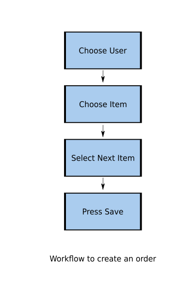
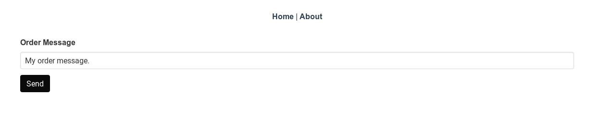

# Adding Order Management

Before we get started with adding order management, let's make some server-side changes to enforce foreign key constraints.
This will make the database querying easier with respect to foreign keys and also provides us with helper function when working with ecto.

## Renaming Fields in Ecto Schema

To start with, lets write a migration to rename all fields in **schemas** to end with **\_id** if it refers to a foreign key. This will make all foreign keys explicit and also
will be useful in future, when we are writing ecto queries.

```bash
mix ecto.gen.migration rename_fields_for_foreign_keys
```

And fill in **repo/migrations/rename_fields_for_foreign_keys.exs** with following content.

```ruby
defmodule Ms.Repo.Migrations.RenameFieldsForForeignKeys do
  use Ecto.Migration

  def change do
    rename table("order_items"), :order, to: :order_id
    rename table("order_items"), :product, to: :product_id
    rename table("orders"), :customer, to: :customer_id
    rename table("deliveries"), :order_item, to: :order_item_id
  end
end
```

Once we have changed the database tables, the **schema** files should be changed to reflect it.

Let's take a look at the changes in **lib/ms/customer_management/customer.ex** file.

```ruby
defmodule Ms.CustomerManagement.Customer do
  use Ecto.Schema
  import Ecto.Changeset

  schema "customers" do
    field :details, :map
    field :name, :string
    field :phone, :string
    field :pincode, :string
    # has_many tells that there can be multiple orders from a customer
    # This can be used to preload all orders from a customer
    has_many :orders, Ms.OrderManagement.Order

    timestamps()
  end

  @doc false
  def changeset(customer, attrs) do
    customer
    |> cast(attrs, [:name, :phone, :pincode, :details])
    |> validate_required([:name, :phone, :pincode, :details])
  end
end
```

As you can see in comments we added **has_many**. It is a macro, which does not do anything to database, but allows us to access the corresponding **Ms.OrderManagement.Order** via the foreign key.
It also allows us to easily prefetch it, without writing any SQL.

Similarly we change **lib/ms/delivery_management/delivery.ex** as follows

```ruby
defmodule Ms.DeliveryManagement.Delivery do
  use Ecto.Schema
  import Ecto.Changeset

  schema "deliveries" do
    field :address, :map
    field :details, :map
    field :fare, :float
    # If a name ends with _id ecto consider it to be an id or a foreign key id.
    field :order_item_id, :id
    # belongs_to says that this deliveries schema has a
    # foreign key reference to customers schema.
    # Just like has_many, it too offers more flexibility, when querying using ecto
    belongs_to :customer, Ms.CustomerManagement.Customer

    timestamps()
  end

  @doc false
  def changeset(delivery, attrs) do
    delivery
    |> cast(attrs, [:fare, :address, :details])
    |> validate_required([:fare, :address, :details])
  end
end
```

**belongs_to** adds **customer_id** foreign key to our schema and also allows fetching of **Ms.CustomerManagement.Customer** corresponding to the **customer_id** key.
We do the same for **lib/ms/inventory_management** schemas too. If you find these confusing look at the excellent tutorial at [Elixir School](https://elixirschool.com/en/lessons/ecto/associations/) about
ecto and associations.

Lets run our migrations

```bash
mix ecto.migrate
```

Now that we are done with migrations, let add support for **order items** for an **order**. Lets start with adding some constraints on **lib/ms/order_management/order_item.ex**.
In order for an **order_item** to be added to database, it should be part of an **order**. We can enforce it using [foreign_key_constraint](https://hexdocs.pm/ecto/Ecto.Changeset.html#foreign_key_constraint/3).

Let's consider our code.

```ruby
defmodule Ms.OrderManagement.OrderItem do
  use Ecto.Schema
  import Ecto.Changeset

  schema "order_items" do
    field :amount, :integer
    field :unit_price, :float
    belongs_to :product, Ms.InventoryManagement.Product
    belongs_to :order, Ms.OrderManagement.Order

    timestamps()
  end

  @doc false
  def changeset(order_item, attrs) do
    order_item
    |> cast(attrs, [:amount, :unit_price, :order_id])
    |> validate_required([:amount, :unit_price, :order_id])
    |> foreign_key_constraint(:order)
  end
end
```

Here **foreign_key_constraint(:order)** means that the **:order_id** of **order_items** schema, should already exist in **orders** table. Otherwise the changeset will be invalid.
This makes sure that, we don't accidentally insert any invalid data.

## Modeling JSON representation for Order

Now that we have implemented our **order schema** with **order_items**, one question remains. When we ask for an **order**, should it automatically also provide all associated **order_items** ?.
In our case, I would say yes. Almost every time, we fetch our order, we will also need order_items. So why not always preload order_items along with an order. In order to render **order_items** with **order**,
we will need to provide a serializer for **order_item**. For this we change our **ms/order_management/order_item.ex** as follows.

```ruby
defmodule Ms.OrderManagement.OrderItem do
  use Ecto.Schema
  import Ecto.Changeset

  # Automatically constructs a JSON with amount, id, unit_price, order_id
  # when we render an order_item.
  @derive {Jason.Encoder, only: [:amount, :id, :unit_price, :order_id]}
  schema "order_items" do
    field :amount, :integer
    field :unit_price, :float
    belongs_to :product, Ms.InventoryManagement.Product
    belongs_to :order, Ms.OrderManagement.Order

    timestamps()
  end

  @doc false
  def changeset(order_item, attrs) do
    order_item
    |> cast(attrs, [:amount, :unit_price, :order_id])
    |> validate_required([:amount, :unit_price, :order_id])
    |> foreign_key_constraint(:order)
  end
end
```

As per the comment **@derive** uses the **Jason** encoder to automatically provide us with a JSON representation for **order_item**. Now the only step left is to always **preload** all order requests with order_items field.
This can be achieved by updating the **lib/ms/order_management.ex** code as follows.

```ruby
  @doc """
  Gets a single order.

  Raises `Ecto.NoResultsError` if the Order does not exist.

  ## Examples

      iex> get_order!(123)
      %Order{}

      iex> get_order!(456)
      ** (Ecto.NoResultsError)

  """
  def get_order!(id), do: Repo.get!(Order, id) |> Repo.preload(:order_items)

  @doc """
  Creates a order.

  ## Examples

      iex> create_order(%{field: value})
      {:ok, %Order{}}

      iex> create_order(%{field: bad_value})
      {:error, %Ecto.Changeset{}}

  """
  def create_order(attrs \\ %{}) do
    response = %Order{}
    |> Order.changeset(attrs)
    |> Repo.insert()

    case response do
      {:ok, order} ->
        Enum.map(attrs["order_items"],
          fn oi -> create_order_item(Map.merge(oi, %{"order_id" => order.id})) end
        )
        {:ok, order |> Repo.preload(:order_items) }

      {:error, e} -> {:error, e}
    end
  end
```

For both **get_order** and **create_order**, we [**preload**](https://hexdocs.pm/ecto/Ecto.Repo.html#c:preload/3) order_items using **Repo.preload(:order_items)**.
Let's run our tests to see if everything went right.

```bash
mix test
```

## Fixing Failing Tests

Unfortunately some of our tests fail. Most of them fail because, when testing **order_items**, we don't provide a valid **order_id**.
It can be easily fixed, by first creating an order and then passing the order_id from the created order into the order_item request. Now some other tests fails due to mismatch in **struct** structure in Elixir.
It can fixed by replacing all **:atom** keys in structures to **string**. For example, we need to change from %{name: "Name"} to %{"name" => "Name"}. This is required because in Elixir **:name** is not the same as **"name"**.

Tests also expose that we have a bug in handling cascading deletes. Our current migration in **repo/migrations/20190613185803_create_order_items.exs** works as follows.

```ruby
defmodule Ms.Repo.Migrations.CreateOrderItems do
  use Ecto.Migration

  def change do
    create table(:order_items) do
      # When a product is deleted, we do nothing. This is wrong as
      # the product we need to sell doesn't exist. We should replace
      # it to cascading delete.
      add :product, references(:products, on_delete: :nothing)
      add :order, references(:orders, on_delete: :nothing)
    end
  end
end
```

To allow deleting of products, we need to change **on_delete: :nothing** to **on_delete: :delete_all**. This deletes all **order_items** when a product is deleted.

Note: In some cases, it is required to preserve all order history. But as you will see later, this can be easily fixed.

So lets create a new migration to fix this issue.

```bash
mix ecto.gen.migration change_constraints_on_order_items
```

And add the following code

```ruby
defmodule Ms.Repo.Migrations.ChangeConstraintsOnOrderItems do
  use Ecto.Migration

  def change do
    drop constraint("order_items", "order_items_product_fkey")
    drop constraint("order_items", "order_items_order_fkey")

    alter table(:order_items) do
      modify(:product_id, references(:products, on_delete: :delete_all))
      modify(:order_id, references(:orders, on_delete: :delete_all))
    end
  end
end
```

Run our migration and then the tests.

```bash
mix ecto.migrate
mix test
```

Now all our tests are green again :D.
So now that we have completed the whole backend requirements for implementing orders, we will start with implementing the UI for orders.

## Building Order Views

Before we start implementing UI for order management, we need to change the **unitPrice** and **creationDate** to **unit_price** and **creation_date** in client side too.
This is pretty easy as all our types are defined in **src/types/types.ts**.

The changed code is as follows.

```typescript
export interface OrderItem {
  updated_at: Date;
  // Changed from unitPrice
  unit_price: number;
  product_id: number;
  order_id: number;
  inserted_at: Date;
  id: number;
  amount: number;
}
export interface Order {
  updated_at: Date;
  message: string;
  inserted_at: Date;
  id: number;
  details: object;
  customer_id: number;
  // creationDate
  creation_date: Date;
}
```

Now we get started with implementing our order management UI. Our workflow for adding a new order should be as follows.



As a starting step, lets copy required files from product management and rename all occurrences of **Product** to **Order** and all **product** to **order**. This also applies to files also.

So our component directory structure for order should look as follows

```bash
order
├── AddOrder.vue
├── EditOrder.vue
├── OrderList.vue
└── OrderView.vue
```

So our **src/components/order/OrderView.vue** looks as below.

```html
<template>
  <div>
    <div class="field">
      <div class="control">
        <label for="orderMessage" class="label">
          {{ $t('orderMessage.label') }}
        </label>
        <input class="input" id="orderMessage" type="text"
          v-model="currentOrder.message" />
      </div>
    </div>

    <ul>
      <li v-for="item in currentOrder.order_items" :key="item.id">{{item}}</li>
    </ul>

    <div class="field">
      <div class="control">
        <slot></slot>
      </div>
    </div>
  </div>
</template>

<script lang='ts'>
import { Order, Customer, getEmptyCustomer } from '@/types/types.ts';
import { Component, Prop } from 'vue-property-decorator';
import Vue from 'vue';

@Component({
  components: {},
})
export default class OrderView extends Vue {
  // Prop are data values that are passed from parent component to child component.
  @Prop()
  public currentOrder!: Order;
}
</script>

<i18n>
{
  "de": {
    "orderMessage": {
      "label": "Nachricht bestellen"
    }
  },
  "en": {
    "orderMessage": {
      "label": "Order Message"
    }
  }
}
</i18n>

<style lang='sass' scoped>
</style
```

As you can see we only display the order message and order items. There is no information about customers. There is also no UI to choose order items.
In order to have a good user experience, we will have implement something like an autocomplete and drop down to allow to choose products and customers.
If customer doesn't exist, we should also allow to create a new one. This requires support from backend. For this reason, we will implement this functionality in next chapter. Now we will stick to this placeholder implementation.

## Implementing Order Service

Now we will implement the **src/services/orderService.ts**

```typescript
import { Order, getEmptyOrder } from "@/types/types";
import { BaseService } from "./baseService";

export class OrderService extends BaseService<Order> {
  // constructors should call parent class with super()
  constructor(endpoint: string, entity: string, requestPrefix: string) {
    super(endpoint, entity, requestPrefix);
  }

  public getEmpty(): Order {
    return getEmptyOrder();
  }
}
```

So we need to add implementation for **getEmptyOrder** to our **types/types.ts**.

```typescript
class OrderImpl implements Order {
  updated_at: Date = new Date();
  message: string = "";
  inserted_at: Date = new Date();
  id: number = -1;
  details: object = {};
  customer_id: number = -1;
  creation_date: Date = new Date();
  order_items: OrderItem[] = [];

  /* Mapped Types in Typescript.
   * Partial<T> makes all fields of T as optional.
   * This allows us to just update the values passed in 
   * constructor(which itself is optional with?) and assigns to our object.
   * Then we initialize like new CustomerImpl({name: "MyName"})
   */
  public constructor(order?: Partial<Order>) {
    Object.assign(this, order);
  }
}

// Factory methods
export function getEmptyProduct() {
  return new ProductImpl();
}

export function getEmptyCustomer() {
  return new CustomerImpl();
}

export function getEmptyOrder() {
  return new OrderImpl();
}
```

Similarly add **src/store/modules/orders.ts**.

```typescript
import {
  VuexModule,
  Module,
  getModule,
  Mutation,
  Action,
} from "vuex-module-decorators";
import store from "@/store";
import { Order } from "@/types/types";
import { OrderService } from "@/services/orderService";

/**
 * When namespaced is set to true, contents of the module is automatically 
 * namespaced based on name. Vuex allows adding modules to store 
 * dynamically after store is created, when dynamic flag is set to true.
 * store is the Vuex store to which we need to insert our module.
 */
@Module({
  namespaced: true,
  name: "orders",
  store,
  dynamic: true,
})
class OrderModule extends VuexModule {
  /**
   * Class variables automatically become part of the state.
   * Our module thus will have orders/allOrders and orders/service 
   * as state variables. The reason we put service inside Vuex is because in this 
   * case there will be only one OrderService which can be shared
   * between all components.
   */
  public allOrders: Order[] = [];
  public service: OrderService = new OrderService(
    "http://0.0.0.0:4000/api/v1/",
    "orders",
    "order"
  );

  // Action automatically calls setOrders function with arguments
  // returned by fetchOrders function.
  @Action({ commit: "setOrders" })
  public async fetchOrders() {
    // Calls into service to get all orders
    const t = await this.service.getAllRequest();
    return t.data.data;
  }

  // modifies our module state, by setting allOrders to p.
  @Mutation
  public setOrders(p: Order[]) {
    this.allOrders = p;
  }
}

// Export our module so our components can use it.
export default getModule(OrderModule);
```

As you can see, this file is almost the same like **src/store/modules/products.ts**. We can just copy **products.ts** and replace **Product** with **Order** and **product** with **order** to get this file.

So now the only thing left to do is to add the new order components to **router.ts**.

```typescript
//src/router.ts
    {
      path: '/orders',
      name: 'orders',
      component: () => import('./components/order/OrderList.vue'),
    },
    {
      path: '/orders/add',
      name: 'add-order',
      component: () => import('./components/order/AddOrder.vue'),
    },
    {
      path: '/orders/edit/:id',
      name: 'edit-order',
      component: () => import('./components/order/EditOrder.vue'),
      props: true,
    },
```

Now we should be able to add new order at [localhost:8080/orders/add](http://localhost:8080/orders/add).
Similarly we can view all orders at [localhost:8080/orders/](http://localhost:8080/orders/add).



In next chapter, we will add an autocomplete with search functionality and improve the UI for creating new orders.
