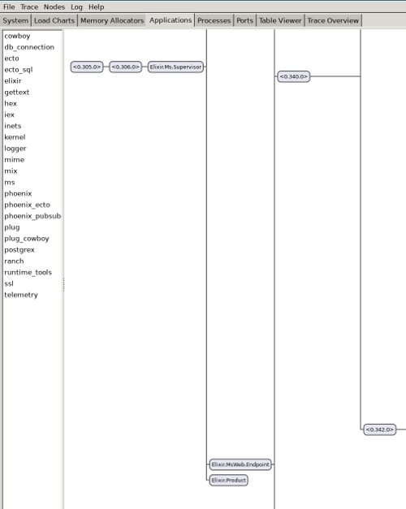
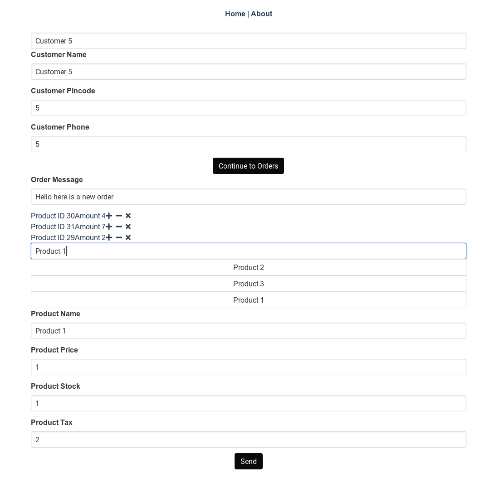
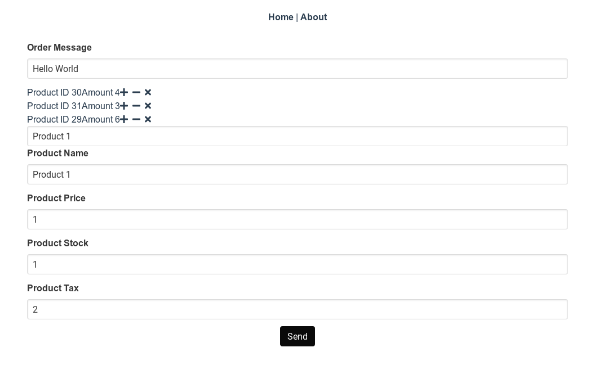

# Adding new features to Order Management

In last chapter, we added a bare minimum order management functionality, where you can add only an order message.
In this chapter, we will add functionality to add order items and a customer to the order.
The order items and customer can be chosen with an autocomplete menu. So let's get started.

## Implementing Autocomplete

The autocomplete functionality for products will be based on product name.
So if the user enters a part of the product name, we should show the product with its full name.
Our current autocomplete will be naive and will find products using a [LIKE](https://www.postgresql.org/docs/9.3/functions-matching.html) query in **SQL**.
We will also cache all results using [ETS](https://elixir-lang.org/getting-started/mix-otp/ets.html). This will help to reduce the database lookups.

In order to implement the autocomplete functionality, we need to add a new endpoint to our server. Let's place it under **products/search**.

Lets add our product search functionality with **InventoryManagement.search_product** function inside **lib/ms/inventory_management.ex**.

```ruby
@doc """
Returns a single Product
"""
def search_product(term) do
  query =
    from p in Product,
      select: p,
      where: ilike(p.name, ^"%#{term}%")

  Repo.all(query)
end
```

Here we use [ilike](https://hexdocs.pm/ecto/Ecto.Query.API.html#ilike/2) which does a case-insensitive **LIKE** in SQL.
The [**^**](https://hexdocs.pm/ecto/Ecto.Query.html#module-interpolation-and-casting) inside **ilike** is used to bind to dynamic values.
In our case we pass our **term** argument inside SQL query. Now let's make this functionality available to our web controllers.

We will pass all required data with **GET** request as url parameters. It is a better option than passing data with the **body of the request**.
Some firewalls may even strip the body from a **GET** request.

Inside **lib/ms_web/controllers/product_controller.ex**, we add the **search** function to handle our searches.

```ruby
def search(conn, %{"term" => term}) do
  products = InventoryManagement.search_product(term)
  render(conn, "index.json", products: products)
end
```

Now we just need to register an endpoint in **lib/ms_web/router.ex**.

```ruby
scope "/v1" do
    get "/products/search", ProductController, :search
```

An automated test case would be a good idea, to test this functionality. This will also be useful when we add the cache.
Inside **test/ms_web/controllers/product_controller.exs**

```ruby
describe "search products" do
  setup [:create_product]

  test "searches all products containing string", %{conn: conn} do
    conn = get(conn, Routes.product_path(conn, :search, %{term: "ome"}))
    assert [%{"name" => "some name"}] = json_response(conn, 200)["data"]
  end
end
```

This new test should pass. If you want to test manually, going
to [http://localhost:4000/api/v1/products/search?term=om](http://localhost:4000/api/v1/products/search?term=om), will give us all products whose name has the string **om** in it.

## Caching Results using GenServer

Now it's a good time to add a cache to our product search. We will use a [GenServer](https://hexdocs.pm/elixir/GenServer.html) to do our caching.
Our cache will be run in a separate process and this process will hold our **ets** tables making our problem more resilient to crashes.
Before we add the cache, we got a few basics to cover. These basics will help you understand why Elixir/Erlang is very suited to writing fault-tolerant applications.
Since I don't want to repeat what I've already written, please read [this](https://josv.me/post/elixir/elixirforpythonists_3/) and come back.

We will add a our caching GenServer inside **lib/ms/cache_management/product.ex** file.

```ruby
defmodule Ms.CacheManagement.Product do
  @moduledoc """
    Caches our product data, based on substring index
  """

  use GenServer

  # Starts a GenServer process running this module
  def start_link(_opts) do
    # This name will be used to send message in GenServer.cast and GenServer.call
    GenServer.start_link(__MODULE__, %{}, name: Product)
  end

  # This function will be executed when a GenServer is spawned and output 
  # of this function becomes the state of the Genserver.
  def init(state) do
    :ets.new(:inventory_cache, [:set, :public, :named_table])
    {:ok, state}
  end

  def delete(key) do
    # GenServer.cast is asynchronous on client side, while GenServer.call 
    # is Synchronous(blocking)
    GenServer.call(Product, {:delete, key})
  end

  def clean_cache() do
    GenServer.call(Product, {:clean})
  end

  # Notice that here we don't use GenServer.
  # If we use GenServer, all reads will end up being a serial operation, 
  # as GenServer executes serially
  # ETS allows concurrent reads, so we directly query the ETS and all other 
  # operations like put and delete goes through GenServer, inturn serializing them.
  def get(key) do
    case :ets.lookup(:inventory_cache, key) do
      [] -> []
      [{_key, product}] -> product
    end
  end

  # Notice that we use GenServer.call even if we don't take return value.
  # This is required because GenServer.cast is asynchronous and hence is not strict
  # If we use cast, we can't guarantee that put will have put the value in ets, 
  # when it returns.
  def put(key, value) do
    # We use cast when we don't care about the result
    GenServer.call(Product, {:put, key, value})
  end

  # All GenServer.cast calls ends up calling handle_cast
  def handle_call({:delete, key}, _from, state) do
    :ets.delete(:inventory_cache, key)
    # Since we don't care about result, we reply with :ok
    {:reply, :ok, state}
  end

  def handle_call({:put, key, data}, _from, state) do
    :ets.insert(:inventory_cache, {key, data})
    {:reply, :ok, state}
  end

  def handle_call({:clean}, _from, state) do
    :ets.delete_all_objects(:inventory_cache)
    {:reply, :ok, state}
  end

  # All GenServer.call calls ends up calling handle_call
  # If we don't have this handling, which collects all messages, we can have 
  # a memory leak as elixir doesn't throw away unmatched/unhandled messages.
  # Here using this handler we just throw them away.
  def handle_call(_msg, _from, state) do
    {:reply, :ok, state}
  end
end
```

Now we modify our **lib/ms_web/controllers/product_controller.ex** to make use of our cache.

```ruby
defmodule MsWeb.ProductController do
  use MsWeb, :controller

  alias Ms.InventoryManagement
  alias Ms.InventoryManagement.Product
  alias Ms.CacheManagement

  action_fallback MsWeb.FallbackController

  def index(conn, _params) do
    products = InventoryManagement.list_products()
    render(conn, "index.json", products: products)
  end

  def create(conn, %{"product" => product_params}) do
    with {:ok, %Product{} = product} <- 
      InventoryManagement.create_product(product_params) do
      CacheManagement.clean_product_cache()

      conn
      |> put_status(:created)
      |> put_resp_header("location", Routes.product_path(conn, :show, product))
      |> render("show.json", product: product)
    end
  end

  def show(conn, %{"id" => id}) do
    product = InventoryManagement.get_product!(id)
    render(conn, "show.json", product: product)
  end

  def update(conn, %{"id" => id, "product" => product_params}) do
    product = InventoryManagement.get_product!(id)

    with {:ok, %Product{} = product} <-
           InventoryManagement.update_product(product, product_params) do
      CacheManagement.clean_product_cache()
      render(conn, "show.json", product: product)
    end
  end

  def delete(conn, %{"id" => id}) do
    product = InventoryManagement.get_product!(id)

    with {:ok, %Product{}} <- InventoryManagement.delete_product(product) do
      CacheManagement.clean_product_cache()
      send_resp(conn, :no_content, "")
    end
  end

  def search(conn, %{"term" => term}) do
    # First, we try to get products from the cache
    products = CacheManagement.get_products(term)

    if products == [] do
      # If cache is empty, we fetch from database and write to cache
      products = InventoryManagement.search_product(term)
      CacheManagement.put_product(term, products)
    end

    # Load value again from cache
    products = CacheManagement.get_products(term)
    render(conn, "index.json", products: products)
  end
end
```

## Add Cache to Application

Now all that is left to do is the ask our **Phoenix** [application](https://hexdocs.pm/elixir/Application.html) to start our cache with it.
To do this add our cache inside the **children** list inside **start** in file **lib/ms/application.ex**. Now our cache is supervised and if it crashes will be
rebooted based on strategy defined in our Application.

```ruby
def start(_type, _args) do
  # List all child processes to be supervised
  children = [
    # Start the Ecto repository
    Ms.Repo,
    # Start the endpoint when the application starts
    MsWeb.Endpoint,
    # Starts a worker by calling: Ms.Worker.start_link(arg)
    # {Ms.Worker, arg},
    Ms.CacheManagement.Product
  ]
```

All our tests should pass after the addition of cache.

## Visualizing GenServer with Observer

For those of you who are wondering if it is possible to visualize our new GenServer, there is a good news.
Run the phoenix app inside iex and we should be able to use the observer to see the whole application.

```bash
iex -S mix phx.server
:observer.start
```



Notice the **Elixir.Product** at the bottom, that is our product cache. It was named based on the name we gave in **start_link** in **ms/cache_management/product.ex** file.

In a similar fashion, we can implement our **Customer Cache**. Please take a look at code to see the actual implementation.

Now that our backend is ready, lets move on to the frontend. Our frontend will be pretty crude in the beginning. We will fix those in coming chapters :D.

As you know, our **AddOrder** is pretty primitive. In order to make it more user friendly, we need to have an autocomplete functionality in UI. Autocomplete should work for both customer and products.

## Building Autocomplete UI Vue Component

The contents of **src/components/utils/AutoComplete.vue** is as follows.

```html
<template>
  <!--
    We want to avoid all default event propagations on the input form.
    So we use @click.stop @keyup event will be triggered when user 
    has finished entering a character.
    -->
  <div @click.stop>
    <input
      type="text"
      v-model="autoCompleteInput"
      class="input"
      :placeholder="displayText"
      @focus="active=true"
      @keyup="updateList"
    />
    <!-- 
      We loop through all suggestions using v-for and put them 
      inside a unordered list (ul). The loop will be rendered as
      <ul>
        <li> Option 1</li>
        <li> Option 2</li>
      </ul>
      -->
    <ul name="autocomplete" v-if="active">
      <li
        :value="l.name"
        v-for="l in autoCompleteSuggestions"
        v-bind:key="l.id"
        @click.prevent="selectionChanged(l)"
        class="button is-fullwidth"
        style="border-radius: 0px"
      >
        {{l.name}}
      </li>
    </ul>
  </div>
</template>

<script lang="ts">
  import Vue from "vue";
  import { Customer } from "@/types/types.ts";
  import { Component, Prop } from "vue-property-decorator";
  import { AxiosPromise } from "axios";

  @Component({
    components: {},
  })
  export default class AutoComplete<T extends { name: string }> extends Vue {
    /**
     * searchFn takes a string and return an AxiosPromise.
     * With this function signature we can easy pass currentInput and get 
     * possible auto completions from backend easily.
     */
    @Prop()
    public searchFn!: (s: string) => AxiosPromise<{ data: T[] }>;

    /**
     * This is our html placeholder, which writes something 
     * like enter a customer name/ product name
     */
    @Prop()
    public displayText!: string;

    /**
     * Our input variable which is bound to html input form.
     * As you can see, we use v-model from vue, which binds autoCompleteInput 
     * to html input. v-model provides 2-way data binding such that change 
     * in one will be automatically propagated to other.
     */

    private autoCompleteInput: string = "";

    /**
     * Autocomplete suggestions list will only be shown when active is set to true.
     * When the html input box is focused, we set it to true using 
     * the @focus event from browser. When a value is chosen, we set it to false.
     */
    private active: boolean = false;

    /**
     * List holding our auto complete suggestions, we got from the server.
     * Actually the type T is pretty useless here, as vue internally 
     * instantiates the component.
     */
    private autoCompleteSuggestions: T[] = [];

    public async mounted() {
      /* Inside function(), we will have a new this, which points to the 
       * function itself. So we store current this to vueThis and access 
       * vue instance using vueThis.
       */
      let vueThis = this;
      document.addEventListener("click", function () {
        vueThis.active = false;
      });
      this.autoCompleteSuggestions = [];
    }

    /**
     * Function which connects to backend and asks for auto completions 
     * based on current html input and updates the html list
     */
    public updateList(event: KeyboardEvent): void {
      let request = this.searchFn(this.autoCompleteInput);
      let vueThis = this;
      request.then(
        (result) => (vueThis.autoCompleteSuggestions = result.data.data)
      );
    }

    /**
     * Emits event to parent component when an option is chosen from suggestion list
     */
    public selectionChanged(l: T) {
      // user @Emit
      this.$emit("OptionSelected", l);
      // To give visual feedback to user, we also set html input to chosen item.
      this.autoCompleteInput = l.name;
      this.active = false;
    }
  }
</script>
```

Now that we got a generic autocomplete component which can take values based on a **search function**, let's build a view to show an **Order Item** to the user.
Before we implement view we need to implement **OrderItemImpl** class. It can be as follows.

```typescript
class OrderItemImpl implements OrderItem {
  updated_at: Date = new Date();
  unit_price: number = -1;
  product_id: number = -1;
  order_id: number = -1;
  inserted_at: Date = new Date();
  id: number = -1;
  amount: number = 1;

  public constructor(orderItem?: Partial<OrderItem>) {
    Object.assign(this, orderItem);
  }
}

export function getEmptyOrderItem() {
  return new OrderItemImpl();
}
```

Our current backend implementation, doesn't provide **product_id** for **orderitem**. To fix it, we add **:product_id** to schema present in **lib/ms/order_management/order_item.ex** file as follows.

```ruby
@derive {Jason.Encoder, only: [:amount, :id, :unit_price, :order_id, :product_id]}
```

Now we can implement **OrderItemView** which is as follows contained in file **src/components/orderitem/OrderItemView.vue**.

```html
<template>
  <div v-if="item">
    <table>
      <tr>
        <td>
          Product ID {{item.product_id}}
        </td>
        <td>
          Amount {{item.amount}}
        </td>
      </tr>
    </table>
  </div>
</template>

<script lang="ts">
  import { Component, Prop } from "vue-property-decorator";
  import Vue from "vue";
  import { OrderItem, Product } from "@/types/types";
  @Component({
    components: {},
  })
  export default class OrderItemView extends Vue {
    @Prop()
    public item!: OrderItem;
  }
</script>
```

Our component is bare minimum and doesn't even have a decent UI. But we will fix it later. A good addon for **AddOrder.vue** would be a button to adjust the quantity of products ordered.
So we will add a button to increment the quantity and one to decrement it. We will build it into **OrderView.vue** as an **Order Item** ultimately belongs to an order.

```html
<template>
  <div>
    <div class="field">
      <div class="control">
        <label for="orderMessage" class="label"
          >{{ $t('orderMessage.label') }}</label
        >
        <input
          class="input"
          id="orderMessage"
          type="text"
          v-model="currentOrder.message"
        />
      </div>
    </div>

    <div>
      <!--
        We loop through all order items and add a + and - button.
        We also bind it to plusClicked and minusClicked functions respectively.
        We also add a button to delete the product
        We use font-awesome icons for + and - signs and align it in a row.
      -->
      <table>
        <tr v-for="item in currentOrder.order_items" :key="item.product_id">
          <td>
            <OrderItemView :item="item"></OrderItemView>
          </td>
          <td v-if="showAmountChanger" @click="plusClicked(item)">
            <i class="fas fa-plus"></i>
          </td>
          <td v-if="showAmountChanger">&nbsp;&nbsp;</td>
          <td v-if="showAmountChanger" @click="minusClicked(item)">
            <i class="fas fa-minus"></i>
          </td>
          <td v-if="showAmountChanger">&nbsp;&nbsp;</td>
          <td v-if="showAmountChanger" @click="deleteClicked(item)">
            <i class="fas fa-times"></i>
          </td>
        </tr>
      </table>
    </div>

    <!--
      Slot enable to replace <slot></slot> with a component.
      -->
    <div class="field">
      <div class="control">
        <slot></slot>
      </div>
    </div>
  </div>
</template>

<script lang="ts">
  import Vue from "vue";
  import { Order, OrderItem } from "@/types/types.ts";
  import { Component, Prop, Provide } from "vue-property-decorator";
  import OrderItemView from "../orderitem/OrderItemView.vue";

  @Component({
    components: {
      OrderItemView,
    },
  })
  export default class OrderView extends Vue {
    @Prop()
    public currentOrder!: Order;

    @Prop({ default: false })
    public showAmountChanger!: boolean;

    /**
     * We signal a plus clicked or minus clicked with
     * AmountIncremented and AmountDecremented events respectively.
     */
    public plusClicked(item: OrderItem) {
      this.$emit("AmountIncremented", item);
    }

    public minusClicked(item: OrderItem) {
      this.$emit("AmountDecremented", item);
    }

    public deleteClicked(item: OrderItem) {
      this.$emit("OrderItemRemoved", item);
    }
  }
</script>

<i18n>
  { "de": { "orderMessage": { "label": "Nachricht bestellen" } }, "en": {
  "orderMessage": { "label": "Order Message" } } }
</i18n>

<style lang="sass" scoped></style>
```

## Integrating Autocomplete with Orders

As you notice, the changes are minor and lets wire up everything with our **AddOrder.vue** component.
As per our order creation workflow, the user should choose the customer first and then only will have the option to add order items(products). We can model it, by using multiple stages for the order creation.
The first stage will be **ChooseCustomer** and then proceed to **ChooseOrderItems** and ending with **OrderCreated**. We use **OrderCreationStage** union type in Typescript to represent each state.
Lets take a look at our code at **src/components/order/AddOrder.vue**.

The completed **src/components/order/AddOrder.vue** is as follows.

```html
<template>
  <div class="container">
    <div v-if="showNotification" class="notification is-primary">
      {{$t('orderCreated.label')}}
    </div>

    <div>
      <!--
        Here searchCustomers is a function which takes a string and 
        returns a list of customer suggestions. optionSelected event is fired 
        by Autocomplete, when an item from list is chosen.
      -->
      <AutoComplete
        :displayText="$t('searchCustomer.label')"
        :searchFn="searchCustomers"
        @OptionSelected="customerChosen"
      ></AutoComplete>
    </div>
    <!--
      Shows the currenly chosen customer
    -->
    <div>
      <CustomerView :currentCustomer="currentCustomer"></CustomerView>
    </div>

    <div v-if="customerDetailsComplete(this.currentCustomer)">
      <input
        class="button is-black"
        value="Continue to Orders"
        type="submit"
        v-on:click.prevent="moveToChooseOrderItems()"
      />
    </div>

    <div>
      <OrderView
        :currentOrder="this.currentOrder"
        @AmountIncremented="amountIncremented"
        @AmountDecremented="amountDecremented"
        @OrderItemRemoved="orderItemRemoved"
        :showAmountChanger="true"
      ></OrderView>
    </div>

    <div v-if="state == 'ChooseOrderItems'">
      <!--
        Here searchProducts is a function which takes a string and returns 
        a list of product suggestions. optionSelected event is fired by 
        Autocomplete, when an item from list is chosen.
      -->
      <AutoComplete
        :displayText="$t('searchItem.label')"
        :searchFn="searchProducts"
        @OptionSelected="productChosen"
      ></AutoComplete>
      <!--
        Shows the currently chosen product
      -->
      <div>
        <ProductView :currentProduct="currentProduct"></ProductView>
      </div>
    </div>

    <input
      class="button is-black"
      value="Send"
      type="submit"
      v-on:click.prevent="onSubmit"
    />
  </div>
</template>

<script lang="ts">
  import Vue from "vue";
  import {
    Order,
    Product,
    Customer,
    getEmptyOrderItem,
    OrderItem,
  } from "@/types/types.ts";
  import OrderView from "@/components/order/OrderView.vue";
  import { Component, Prop } from "vue-property-decorator";
  import orders from "@/store/modules/orders";
  import products from "@/store/modules/products";
  import AutoComplete from "../utils/AutoComplete.vue";
  import customers from "@/store/modules/customers";
  import CustomerView from "@/components/customer/CustomerView.vue";
  import ProductView from "@/components/product/ProductView.vue";

  // You can't define types inside the class
  type OrderCreationStage =
    | "ChooseCustomer"
    | "ChooseOrderItems"
    | "OrderCreated";

  @Component({
    components: {
      OrderView,
      AutoComplete,
      CustomerView,
      ProductView,
    },
  })
  export default class AddOrder extends Vue {
    private currentOrder: Order = orders.service.getEmpty();
    private state: OrderCreationStage = "ChooseCustomer";
    private currentCustomer: Customer = customers.service.getEmpty();
    private currentProduct: Product = products.service.getEmpty();
    private showNotification = false;

    /**
     * Resets the form.
     * It is called after an order was successfully created.
     */
    public resetAddOrder() {
      this.currentOrder = orders.service.getEmpty();
      this.state = "ChooseCustomer";
      this.currentCustomer = customers.service.getEmpty();
      this.currentProduct = products.service.getEmpty();
    }

    /**
     * Contacts backend using customers service and get autocompletion suggestions
     */
    public searchCustomers(name: string) {
      return customers.service.search({ term: name });
    }

    /**
     * Contacts backend using products service and get autocompletion suggestions
     */
    public searchProducts(name: string) {
      return products.service.search({ term: name });
    }

    public amountIncremented(item: OrderItem) {
      item.amount = item.amount + 1;
    }

    public amountDecremented(item: OrderItem) {
      item.amount = item.amount - 1;
    }

    public orderItemRemoved(item: OrderItem) {
      this.currentOrder.order_items = this.currentOrder.order_items.filter(
        (x) => x.product_id !== item.product_id
      );
    }

    /**
     * Checks if a customer already exists, if it doesn't exist creates 
     * a new customer and sets it as the currentCustomer.
     * When a all customer details are provided, we call this function.
     */
    public moveToChooseOrderItems() {
      if (this.currentCustomer.id === 0) {
        let response = customers.service.create(this.currentCustomer);
        let vueThis = this;
        response.then((v) => {
          vueThis.currentCustomer = v.data.data;
        });
      }
      this.state = "ChooseOrderItems";
    }

    /**
     * Checks if all required customer details are provided
     */
    public customerDetailsComplete(customer: Customer) {
      return (
        customer.phone !== "" && customer.pincode !== "" && customer.name !== ""
      );
    }

    public async onSubmit() {
      this.currentOrder.customer_id = this.currentCustomer.id;
      const response = await orders.service.create(this.currentOrder);

      // If status is 201, which stands for content created we show a notification
      if (response.status == 201) {
        this.resetAddOrder();
        this.showNotification = true;

        // Hide notification after 3 seconds
        setTimeout(() => {
          this.showNotification = false;
        }, 3000);
      }
    }

    public customerChosen(item: Customer) {
      this.currentCustomer = item;
    }

    /**
     * Add the item to list of item in current order.
     * If item already exists in the order items, we skip the item.
     * When a product is chosen, we call this function
     */
    public productChosen(item: Product) {
      // We need to convert the Product to an OrderItem to add into order_items
      let orderItem = getEmptyOrderItem();
      orderItem.product_id = item.id;
      orderItem.amount = 1;

      // Checks if orderItem already exists with the order. If exists,
      // we skip it again and return.
      let orderItemExists = this.currentOrder.order_items.filter(
        (x) => x.product_id === item.id
      );
      if (orderItemExists.length !== 0) {
        return false;
      }

      // Update order with new order item
      this.currentOrder.order_items.push(orderItem);
      this.currentProduct = item;
    }
  }
</script>

<i18n>
  { "de": { "orderCreated": { "label": "Auftrag erstellt" }, "searchCustomer": {
  "label": "Kunden suchen" }, "searchItem": { "label": "Nach Artikeln suchen" }
  }, "en": { "orderCreated": { "label": "Order created" }, "searchCustomer": {
  "label": "Search for Customers" }, "searchItem": { "label": "Search for items"
  } } }
</i18n>
```

## Adding Search to Base Service

Now the only thing left is to add **search** functionality to **src/services/baseService.ts**.

```typescript
public search(searchTerm: {'term': string}): AxiosPromise<{'data': T[]}> {
  const response = 
    axios.get(`${this.endpoint}${this.entity}/search?term=${searchTerm.term}`);
  return response;
```

Now our order creation page should look as follows.



The **src/components/order/EditOrder.vue** is very similar to **AddOrder.vue**, with the only difference that we are unable to change the customer data in **EditOrder.vue**.

```html
<template>
  <div class="container">
    <div v-if="showNotification" class="notification is-primary">
      {{$t('orderCreated.label')}}
    </div>

    <!--
      Shows the currenly chosen customer
    -->
    <div>
      <CustomerView :currentCustomer="currentCustomer"></CustomerView>
    </div>

    <div>
      <OrderView
        :currentOrder="this.currentOrder"
        @AmountIncremented="amountIncremented"
        @AmountDecremented="amountDecremented"
        @OrderItemRemoved="orderItemRemoved"
        :showAmountChanger="true"
      ></OrderView>
    </div>

    <div v-if="state == 'ChooseOrderItems'">
      <!--
        Here searchProducts is a function which takes a string 
        and returns a list of product suggestions. optionSelected event is 
        fired by Autocomplete, when an item from list is chosen.
      -->
      <AutoComplete
        :displayText="$t('searchItem.label')"
        :searchFn="searchProducts"
        @OptionSelected="productChosen"
      ></AutoComplete>
      <!--
        Shows the currently chosen product
      -->
      <div>
        <ProductView :currentProduct="currentProduct"></ProductView>
      </div>
    </div>

    <input
      class="button is-black"
      value="Send"
      type="submit"
      v-on:click.prevent="onSubmit"
    />
  </div>
</template>

<script lang="ts">
  import Vue from "vue";
  import {
    Order,
    Product,
    Customer,
    getEmptyOrderItem,
    OrderItem,
  } from "@/types/types.ts";
  import OrderView from "@/components/order/OrderView.vue";
  import { Component, Prop } from "vue-property-decorator";
  import orders from "@/store/modules/orders";
  import products from "@/store/modules/products";
  import AutoComplete from "../utils/AutoComplete.vue";
  import customers from "@/store/modules/customers";
  import CustomerView from "@/components/customer/CustomerView.vue";
  import ProductView from "@/components/product/ProductView.vue";

  // You can't define types inside the class
  type OrderCreationStage =
    | "ChooseCustomer"
    | "ChooseOrderItems"
    | "OrderCreated";

  @Component({
    components: {
      OrderView,
      AutoComplete,
      CustomerView,
      ProductView,
    },
  })
  export default class AddOrder extends Vue {
    private state: OrderCreationStage = "ChooseOrderItems";
    private currentOrder: Order | null = null;
    private currentCustomer: Customer | null = null;
    private currentProduct: Product | null = null;
    private showNotification = false;

    /**
     * Incoming order id
     */
    @Prop()
    private id!: number;

    public async created() {
      const response = await orders.service.get(this.id);
      this.currentOrder = response.data.data;
    }

    /**
     * Contacts backend using customers service and get autocompletion suggestions
     */
    public searchCustomers(name: string) {
      return customers.service.search({ term: name });
    }

    /**
     * Contacts backend using products service and get autocompletion suggestions
     */
    public searchProducts(name: string) {
      return products.service.search({ term: name });
    }

    public amountIncremented(item: OrderItem) {
      item.amount = item.amount + 1;
    }

    public amountDecremented(item: OrderItem) {
      item.amount = item.amount - 1;
    }

    /**
     * Checks if all required customer details are provided
     */
    public customerDetailsComplete(customer: Customer) {
      return (
        customer.phone !== "" && customer.pincode !== "" && customer.name !== ""
      );
    }

    public async onSubmit() {
      if (this.currentOrder) {
        const response = await orders.service.update(
          this.currentOrder.id,
          this.currentOrder
        );

        // If status is 200, which stands for content updated
        // and so we show a notification
        if (response.status == 200) {
          this.showNotification = true;

          // Hide notification after 3 seconds
          setTimeout(() => {
            this.showNotification = false;
          }, 3000);
        }
      }
    }

    public customerChosen(item: Customer) {
      this.currentCustomer = item;
    }

    /**
     * Add the item to list of item in current order.
     * If item already exists in the order items, we skip the item.
     * When a product is chosen, we call this function
     */
    public productChosen(item: Product) {
      if (this.currentOrder) {
        // We need to convert the Product to an OrderItem to add into order_items
        let orderItem = getEmptyOrderItem();
        orderItem.product_id = item.id;
        orderItem.amount = 1;

        // Checks if orderItem already exists with the order. If exists, 
        // we skip it again and return.
        let orderItemExists = this.currentOrder.order_items.filter(
          (x) => x.product_id === item.id
        );
        if (orderItemExists.length !== 0) {
          return false;
        }

        // Update order with new order item
        this.currentOrder.order_items.push(orderItem);
        this.currentProduct = item;
      }
    }

    public orderItemRemoved(item: OrderItem) {
      if (this.currentOrder) {
        this.currentOrder.order_items = this.currentOrder.order_items.filter(
          (x) => x.product_id !== item.product_id
        );
      }
    }
  }
</script>

<i18n>
  { "de": { "orderCreated": { "label": "Auftrag erstellt" }, "searchCustomer": {
  "label": "Kunden suchen" }, "searchItem": { "label": "Nach Artikeln suchen" }
  }, "en": { "orderCreated": { "label": "Order created" }, "searchCustomer": {
  "label": "Search for Customers" }, "searchItem": { "label": "Search for items"
  } } }
</i18n>
```

Yes, you are right. It is possible to abstract out the common code in **EditOrder.vue** and **AddOrder.vue** and make it smaller. We will leave it as a future task.

Now that we have the UI to handle order edits, lets take a look at backend code for enabling the modification of an order. When an order is edited, we need to pay special attention to order items.
As you know when an order was created, we also created order items inside an order. Due to same reason, when an order changes the order items could also change.
In order to make it easier to implement, when an order is changed, we load all existing order items for the order and delete all of them. Then we create new order items corresponding to the modified order.
The code is for **update_order** in **lib/ms/order_management.ex** is as follows.

```elixir
def update_order(%Order{} = order, attrs) do
  response = order
             |> Order.changeset(attrs)
             |> Repo.update()

  with {:ok, order} <- response do
    preloaded_order = order |> Repo.preload(:order_items)
    existing_order_items = preloaded_order.order_items
    # If order items doesn't exist we provide []
    new_order_items = attrs["order_items"] || []

    # We delete all existing order items which are not in new order items
    for order_item <- existing_order_items do
      case Enum.filter(new_order_items, 
        fn x -> Map.get(x, "id") == Map.get(order_item, "id") end) do
          [] -> delete_order_item(order_item)
          _ -> []
        end
    end

    # We loop through all new order items and if already existing in our order, 
    # we just update them.
    for order_item <- new_order_items do
      case Enum.filter(existing_order_items,
        fn x -> Map.get(x, "id") == Map.get(order_item, "id") end) do
          [] -> create_order_item(Map.merge(order_item, %{"order_id" => order.id}))
          [found] -> update_order_item(
            found,
            Map.merge(order_item, %{"order_id" => order.id})
          )
        end
    end

    {
      :ok,
      order
      |> Repo.preload(:order_items)
    }
  end
end
```

Now our order editing page should look as follows.



So, now we have implemented order creation and editing functionality for our **Order Management System**.

Lets see how our tests are doing.

```
mix test
```

We will see that many of our tests fail. We will see how to fix those failing tests in next chapter.
