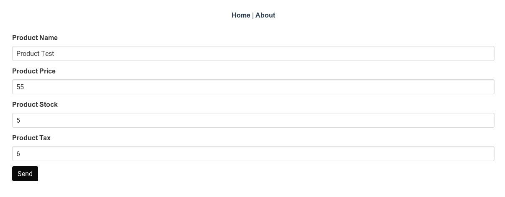

# Making our UI user friendly

In this chapter, we will make our UI user friendly. We have already built interfaces for CRUD operations. We just need to add a nice UI to choose all available functionalities.
Also search functionality would be nice, specifically for Customers and Products. We will also add some links for computing statistics, even though we won't build the functionality in this part :D .
We will name it **HomePage**. It will be as follows.




## Building a HomePage
So lets get started. We will build a nice page with operations for orders, products and customers.
Since the basic layout of all these pages are the same and requires no advanced JS, we can build a base HTML layout, which can be reused. The contents of **src/components/utils/HomePage.vue** are as follows.

```html
<template>
  <div class="tile is-ancestor">
    <!--
      The divs are aligned row by row.
      For this reason we make a div and assign is-vertical to parent div.
      This enables us to align vertically.
      When two these parent is-vertical divs are used, it is combined horizontally
      providing us with the required layout.
      -->
    <div class="tile is-parent is-vertical">
      <article class="tile is-child box">
        <router-link :to="add.link">
          <p class="title">{{add.title}}</p>
          <p class="subtitle">{{add.subTitle}}</p>
          <div class="content">
            <i class="fas fa-plus fa-5x"></i>
          </div>
        </router-link>
      </article>
      <article class="tile is-child box">
        <router-link :to="stats.link">
          <p class="title">{{stats.title}}</p>
          <p class="subtitle">{{stats.subTitle}}</p>
          <div class="content">
            <i class="fas fa-chart-pie fa-5x"></i>
          </div>
        </router-link>
      </article>
    </div>
    <div class="tile is-parent is-vertical">
      <article class="tile is-child box">
        <router-link :to="all.link">
          <p class="title">{{all.title}}</p>
          <p class="subtitle">{{all.subTitle}}</p>
          <div class="content">
            <i class="fas fa-list fa-5x"></i>
          </div>
        </router-link>
      </article>
      <article class="tile is-child box">
        <router-link :to="search.link">
          <p class="title">{{search.title}}</p>
          <p class="subtitle">{{search.subTitle}}</p>
          <div class="content">
            <i class="fas fa-search fa-5x"></i>
          </div>
        </router-link>
      </article>
    </div>
  </div>
</template>

<script lang='ts'>
import { HomePageBoxContent } from "@/types/types";
import { Component, Prop } from "vue-property-decorator";
import Vue from "vue";

@Component({
  components: {}
})
export default class HomePage extends Vue {

  /**
   * We handle add/list/statistics/search operations as props, so that it can reused
   * The HomePageBoxContent is defined as 
   * type HomePageBoxContent = {link: String, title: String, subTitle: String
   */
  @Prop()
  public add!: HomePageBoxContent;
  @Prop()
  public all!: HomePageBoxContent;
  @Prop()
  public stats!: HomePageBoxContent;
  @Prop()
  public search!: HomePageBoxContent;
  public created() {}
}
</script>

<style lang='sass' scoped>

</style>
```
As you can see we have introduce the **HomePageBoxContent** type in **types/types.ts**.

```typescript
export type HomePageBoxContent = {link: String, title: String, subTitle: String}
```

This will ensure that we got all required information to display a [bulma tile](https://bulma.io/documentation/layout/tiles/)

Now we will build specific **HomePage** components. Lets start with **components/customer/CustomerHome.vue**.

```html
<template>
  <HomePage :add="add" :stats="stats" :all="all" :search="search" />
</template>

<script lang='ts'>
import { HomePageBoxContent } from "@/types/types";
import { Component, Prop } from "vue-property-decorator";
import HomePage from "@/components/utils/HomePage.vue";
import Vue from "vue";

@Component({
  components: {
    HomePage
  }
})
export default class ProductHome extends Vue {
  public created() {}

  private add: HomePageBoxContent = {
    link: "/customers/add",
    title: "Add Customer",
    subTitle: "Add Customer"
  };
  private all: HomePageBoxContent = {
    link: "/customers/all",
    title: "View All Customers",
    subTitle: "View All Customers"
  };
  private stats: HomePageBoxContent = {
    link: "/customers/stats",
    title: "Customer Statistics",
    subTitle: "Customer Statistics"
  };
  private search: HomePageBoxContent = {
    link: "/customers/search",
    title: "Search Customer",
    subTitle: "Search Customer"
  };
}
</script>

<style lang='sass' scoped>

</style>
```

As you can see, there is nothing special with this component. Similarly we can build **HomePage** for **products** and **orders**.

## Embedding Views with Vue Slots

Now we lets turn to adding search functionality. If you remember our **components/utils/Autocomplete.vue**, which offers autocomplete, we maybe able to just reuse it again.
Only requirement for our search would be to display entries in autocomplete specific to product/orders/customers. Our **Autocomplete.vue** just shows the name all the time, which is not enough.
But it can be easily fixed with [vueJS slots](https://vuejs.org/v2/guide/components-slots.html#Named-Slots-Shorthand). Lets see how we need to modify our **Autocomplete.vue**.

```html
<template>
    <ul name="autocomplete" v-if="active">
      <li
        :value="item.name"
        v-for="item in autoCompleteSuggestions"
        v-bind:key="item.id"
        @click.prevent="selectionChanged(item)"
        class="button is-fullwidth"
        style="border-radius: 0px"
      >
        <!--
          Slot gets a name with name attribute. Here it is itemView. 
          Then we bind :item to item from v-for loop so that we can use it
          inside our slot.
        -->
        <slot name="itemView" :item="item">
          <!-- Fallback content -->
          {{ item.name }}
        </slot>
      </li>
    </ul>
</template>
```

As you can notice we simply replaced 
```html
{{item.name}} 
```
with a slot.
```html
 <slot name="itemView" :item="item">
    <!-- Fallback content -->
    {{ item.name }}
 </slot>
```

Now we just need to pass values to this slot. Lets look at **src/components/order/AddOrder.vue** to see how its done. Please take a look at inline comments for details.

```html
  <AutoComplete
    :displayText="$t('searchItem.label')"
    :searchFn="searchProducts"
    @OptionSelected="productChosen"
  >
  <!--
    Here with v-slot:itemView, we say we need to fill the slot named itemView.
    With "{item}", we use ES2015 destructing to get item value passed to 
    slot. This is because, vue internally wraps contents of a scoped slot into  
    a single argument function with slot props as the argument.
    See https://vuejs.org/v2/guide/components-slots.html#Destructuring-Slot-Props
  -->
  <template v-slot:itemView="{item}">
    {{item.name}}
  </template>
```

Now we just need to build search functionality for products and customers using **Autocomplete.vue**. Lets take a look at **src/components/customer/CustomerSearch.vue**.

```html
<template>
<div>
         <AutoComplete
        :displayText="$t('searchCustomer.label')"
        :searchFn="searchCustomers"
        @OptionSelected="customerChosen"
      >
      <!--
        Here with v-slot:itemView, we say we need to fill the slot named itemView.
        With "{item}", we use ES2015 destructing to get item value passed to 
        slot. This is because, vue internally wraps contents of a scoped slot into  
        a single argument function with slot props as the argument. See 
        https://vuejs.org/v2/guide/components-slots.html#Destructuring-Slot-Props
      -->
      <template v-slot:itemView="{item}">
        {{item.name}}
        {{item.phone}}
      </template>
      </AutoComplete>
      </div>
</template>

<script lang='ts'>
import Vue from 'vue';
import { Customer } from '@/types/types.ts';
import AutoComplete from '../utils/AutoComplete.vue';
import CustomerView from '@/components/customer/CustomerView.vue';
import { Component, Prop } from 'vue-property-decorator';
import customers from '@/store/modules/customers';
import { setTimeout } from 'timers';

@Component({
  components: {
      AutoComplete
  },
})
export default class SearchCustomer extends Vue {
   /**
   * Contacts backend using customers service and get autocompletion suggestions
   */
  public searchCustomers(name: string) {
    return customers.service.search({ 'term': name });
  }


  public customerChosen(item: Customer) {
      // Move to page
      this.$router.push('/customers/edit/'+item.id);
  }
}
</script>
```

Similarly, we add **components/product/ProductSearch.vue**. Now the only task left is to add paths in **src/router.ts**. Since it is pretty trivial, I leave it out. Please check the code, if you are interested. 

So with this we can come to the end of this book. Thanks a lot for sticking with me till the end of this book. I hope you enjoyed working through it as much as I enjoyed writing it.

Have a nice day and take care :)