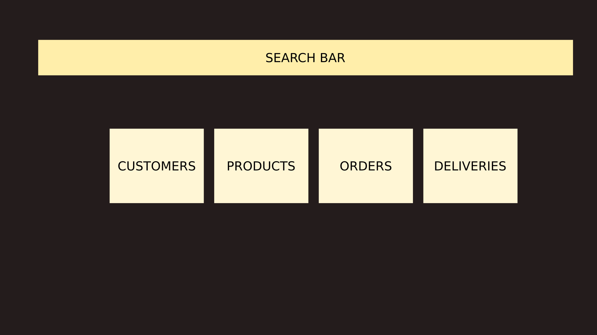
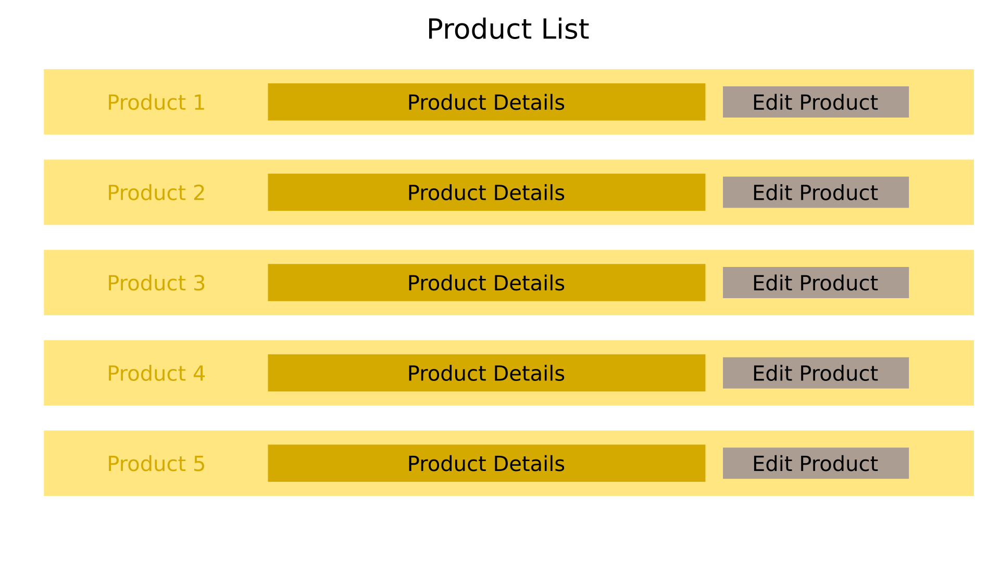
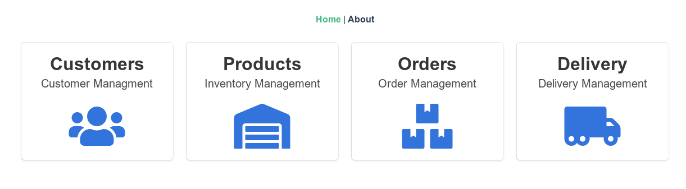

# Building our Homepage view component

## Visual Design of Our App

Before we start coding, lets take a look at a rough sketch of our application. The homepage should look as below.



All the blocks except the search bar are buttons. Clicking on these buttons should take us to a different view/component. For example clicking on **Products** block should get us to **Product list** view which might look as below.



So lets get started building a the home screen **Home.vue**.

## Our first Vue component

Our component will be very simple, as it just have a few links which will take us to respective components as shown above. We will use [bulma](https://bulma.io/) for building our interfaces.

```bash
npm install bulma
```

This will install bulma and we also need to use [font-awesome](https://fontawesome.com/) for our fonts. We will directly link to the CDN inside our **index.html** file header as shown below. Other parts are ommitted.

```html
<head>
  <meta charset="utf-8" />
  <meta http-equiv="X-UA-Compatible" content="IE=edge" />
  <meta name="viewport" content="width=device-width,initial-scale=1.0" />
  <link rel="icon" href="<%= BASE_URL %>favicon.ico" />
  <title>shop</title>
  <script
    defer
    src="https://use.fontawesome.com/releases/v5.3.1/js/all.js"
  ></script>
</head>
```

In order to link to pages, we will use router-link. The code is explained in the comments inside the **Home.vue** file. We will use bulma [tiles](https://bulma.io/documentation/layout/tiles/) for aligning our boxes.
The working of tiles is explained [here](https://bulma.io/documentation/layout/tiles/#how-it-works-nesting). **Fontawesome** icons are used inside the boxes.

```html
<template>
  <div class="container">
    <div class="tile is-ancestor">
      <!-- The ancestor of all tiles -->
      <div class="tile is-parent">
        <!-- Parent of all child classes -->
        <article class="tile is-child box">
          <!-- child where we show our tile -->
          <!-- We need at least 3 levels of hierarchy. 
               ie. is-ancestor -> is-parent -> is-child -->
          <router-link to="/customers">
            <p class="title">Customers</p>
            <p class="subtitle">Customer Management</p>
            <div class="content">
              <i class="fas fa-users fa-5x"></i>
            </div>
          </router-link>
        </article>
      </div>
      <div class="tile is-parent">
        <article class="tile is-child box">
          <router-link to="/products">
            <p class="title">Products</p>
            <p class="subtitle">Inventory Management</p>
            <div class="content">
              <i class="fas fa-warehouse fa-5x"></i>
            </div>
          </router-link>
        </article>
      </div>

      <div class="tile is-parent">
        <article class="tile is-child box">
          <router-link to="/orders">
            <p class="title">Orders</p>
            <p class="subtitle">Order Management</p>
            <div class="content">
              <i class="fas fa-boxes fa-5x"></i>
            </div>
          </router-link>
        </article>
      </div>
      <div class="tile is-parent">
        <article class="tile is-child box">
          <router-link to="/deliveries">
            <p class="title">Delivery</p>
            <p class="subtitle">Delivery Management</p>
            <div class="content">
              <i class="fas fa-truck-moving fa-5x"></i>
            </div>
          </router-link>
        </article>
      </div>
    </div>
  </div>
</template>

<script lang="ts">
  import { Component, Vue } from "vue-property-decorator";

  @Component({
    components: {},
  })
  export default class Home extends Vue {}
</script>
```

Now our webpage should look as follows.



Thats all for this chapter. We will add our search bar later, once we have our backend ready. In the next chapter, we will start building our inventory management related components, like adding of products and viewing of product lists.
