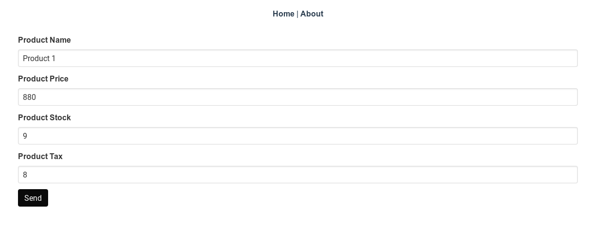

# Adding Vuex to Vue

## Building Product Related Components

Now we get to the meat of our application. We need to add Products to our inventory. Lets start with writing **AddProduct.vue** component.
But before we write an AddProduct component, it would be better to build a **ProductView.vue** component, which can display a product.
Then we can embed this component into our AddProduct component, providing us with a single component for adding/editing and viewing products.

## Two-binding in Vue with v-model

The component is introduces a few new concepts. The first is the **v-model**. [v-model](https://vuejs.org/v2/guide/forms.html) creates a two-way data binding with inputs and component data.
In our case we bind **\<input id="productName"/>** with **currentProduct.name** variable. **currentProduct** is a product object passed as a [prop](https://vuejs.org/v2/guide/components-props.html).
**Props** enable to pass data from parent component to child component.
Here our component **ProductView.vue** is supposed to be embedded in **AddProduct.vue** component.
**AddProduct.vue** component will thus provide us with the value for **currentProduct** which our **ProductView.vue** component will simply display and bind to its **\<input>**.
As we can see in below example we binding all product attributes to input fields in our template. **v-model** also automatically takes care of updating the data based on input fields.
The **{{variable}}** format puts the output of evaluation of Javascript expression **variable** into the html. It belongs to the [template syntax](https://vuejs.org/v2/guide/syntax.html).

```html
<template>
  <div>
    <div class="field">
      <div class="control">
        <!-- {{variable}} is used to put the contents of variable into the html -->
        <label class="label" for="productName"
          >{{ $t('productName.label') }}</label
        >
        <!-- We bind currentProduct.name to this input field -->
        <input
          class="input"
          id="productName"
          type="text"
          v-model="currentProduct.name"
        />
      </div>
    </div>

    <div class="field">
      <div class="control">
        <label for="productPrice" class="label"
          >{{ $t('productPrice.label') }}
        </label>
        <input
          class="input"
          id="productPrice"
          type="text"
          v-model="currentProduct.price"
        />
      </div>
    </div>

    <div class="field">
      <div class="control">
        <label class="label" for="productStock"
          >{{ $t('productStock.label') }}
        </label>
        <input
          class="input"
          id="productStock"
          type="text"
          v-model="currentProduct.stock"
        />
      </div>
    </div>

    <div class="field">
      <div class="control">
        <label class="label" for="productTax"
          >{{ $t('productTax.label') }}</label
        >
        <input
          class="input"
          id="productTax"
          type="text"
          v-model="currentProduct.tax"
        />
      </div>
    </div>

    <div class="field">
      <div class="control">
        <slot></slot>
      </div>
    </div>
  </div>
</template>

<script lang="ts">
  import { Product } from "@/types/types.ts";
  import { Component, Prop } from "vue-property-decorator";
  import Vue from "vue";

  @Component({
    components: {},
  })
  export default class ProductView extends Vue {
    // Prop are data values that are passed from parent component to child component
    @Prop()
    public currentProduct!: Product;
  }
</script>

<style lang="sass" scoped></style>

<i18n>
  { "de": { "productName": { "label": "Produkt Name" }, "productPrice": {
  "label": "Produkt Preis" }, "productStock": { "label": "Produkt Stock" },
  "productDetail": { "label": "Produkt Detail" }, "productTax": { "label":
  "Produkt Steuer" } }, "en": { "productName": { "label": "Product Name" },
  "productPrice": { "label": "Product Price" }, "productStock": { "label":
  "Product Stock" }, "productDetail": { "label": "Product Detail" },
  "productTax": { "label": "Product Tax" } } }
</i18n>
```

Now lets turn our attention to **AddProduct.vue** component.

```html
<template>
  <div class="container">
    <form>
      <ProductView :currentProduct="this.currentProduct">
        <input
          class="button is-black"
          value="Send"
          type="submit"
          v-on:click.prevent="onSubmit"
        />
      </ProductView>
    </form>
  </div>
</template>

<script lang="ts">
  import Vue from "vue";
  import { Product } from "@/types/types.ts";
  import ProductView from "@/components/product/ProductView.vue";
  import { Component, Prop } from "vue-property-decorator";
  import products from "@/store/modules/products";

  @Component({
    components: {
      ProductView,
    },
  })
  export default class AddProduct extends Vue {
    private currentProduct: Product = products.service.getEmpty();

    public async onSubmit() {
      const response = await products.service.createProduct(
        this.currentProduct
      );
    }
  }
</script>
```

As we can see **ProductView** is embedded inside this component with **:currentProduct** props set to **this.currentProduct**. **currentProduct** is initialized from **productService.ts**.
We also notice that the button **click** is bound to **onSubmit()** function using the **v-on** directive. [v-on](https://vuejs.org/v2/guide/events.html) directive can be used to listen to DOM events and respond with running of some Javascript code.
**onSubmit** is an asynchronous function which calls a webservice. **async/await** enables to handle callback based events in an intuitive linear fashion.
An **async** function returns a [Promise](https://developer.mozilla.org/en-US/docs/Web/JavaScript/Reference/Global_Objects/Promise).
Mozilla docs describes a **Promise** as an object that represents the eventual completion (or failure) of an asynchronous operation, and its resulting value.
In an **async** function an **await** call waits for the promise to be completed and provides the value of promise.
In our case the **await** call waits till the response from the backend comes back. Currently we ignore the output from server, but in future we will handle those.

## State Management with Vuex

Before we move onto see how the request is sent and how the backend handles it, lets assume we got back the response and see how to store the response at our client side.
This is useful because, we don't have to always request the server to give us new data and show the user our cached data at client side.
[Vuex](https://vuex.vuejs.org/) is the official goto solution for state management in Vue. It can act as a central store in an application, with state being automatically updated for all components.
It also provides functions like getters, mutations and actions which provides a uniform interface for working with state.
In typescript we use the [vuex-module-decorators](https://github.com/championswimmer/vuex-module-decorators) for working with Vuex. In order to install use the below command.

```bash
npm install -D vuex-module-decorators
```

Vuex got five main parts.

- State - This is the data we want vuex to keep. It acts as a **single source of truth**. Vuex store everything in a single object which acts a tree storing all the data.
- Getters - Functions which can retrieve state from the store and compute properties from retrieved state.
- Mutations - Way to change the state of Vuex. They are synchronous. Mutations have a string **type** and a **handler**. Handlers performs operations on state. Types are used to identify the mutation.
- Actions - Actions commit mutations. They are asynchronous. We commit mutations inside actions, once we have the required data.
- Modules - In order to keep state manageable we can break down the state into modules. Each module contains its own State, Getters, Mutations and Actions.


The above picture from Vuex homepage show the basic architecture of Vuex.
As we can see components dispatch **Actions** which commits a **Mutation** to **State**.

Our basic store is defined at **src/store/index.ts**. This is an empty store. We will dynamically register modules to this store while we are declaring the modules.

```typescript
import Vue from "vue";
import Vuex from "vuex";

Vue.use(Vuex);

export default new Vuex.Store({
  state: {},
  mutations: {},
  actions: {},
});
```

Now lets take a look at our Vuex module defined at **src/store/modules/products.ts**. Please take a look at inline comments for better understanding of code.

```typescript
import {
  VuexModule,
  Module,
  getModule,
  Mutation,
  Action,
} from "vuex-module-decorators";
import store from "@/store";
import { Product } from "@/types/types";
import { ProductService } from "@/services/productService";

/**
 * When namespaced is set to true, contents of the module is automatically
 * namespaced based on name. Vuex allows adding modules to store
 * dynamically after store is created, if we set dynamic flag to true.
 * store is the Vuex store to which we need to insert our module.
 */
@Module({
  namespaced: true,
  name: "products",
  store,
  dynamic: true,
})
class ProductModule extends VuexModule {
  /**
   * Class variables automatically become part of the state.
   * Our module thus will have products/allProducts and products/service
   * as state variables. The reason we put service inside Vuex is because,
   * in this case there will be only one instance of ProductService
   * which can be shared between all components.
   */

  public allProducts: Product[] = [];
  public service: ProductService = new ProductService(
    "http://0.0.0.0:4000/api/v1/",
    "products"
  );

  // Action automatically calls setProducts function
  // with arguments returned by fetchProducts function.
  @Action({ commit: "setProducts" })
  public async fetchProducts() {
    // Calls into service to get all products
    const t = await this.service.getAllRequest();
    return t.data.products;
  }

  // modifies our module state, by setting allProducts to p.
  @Mutation
  public setProducts(p: Product[]) {
    this.allProducts = p;
  }
}

// Export our module so our components can use it.
export default getModule(ProductModule);
```

In my opinion vuex-module-decorators module take away a lot of pain when working with Vuex :).

Now lets look at how our **ProductService.ts** that talks with the backend and creates/retrieves a product. **ProductService.ts** resides in **src/services** folder.

## HTTP Requests with Axios

In order to talk with backend we use the **axios** library. It can be installed as follows.

```bash
npm install axios
```

```typescript
import axios, { AxiosPromise } from "axios";
import { Product, getEmptyProduct } from "@/types/types";

export class ProductService {
  private endpoint: string;
  private entity: string;

  constructor(endpoint: string, entity: string) {
    this.endpoint = endpoint;
    this.entity = entity;
  }

  public getAllRequest(): AxiosPromise<{ products: Product[] }> {
    const response = axios.get(`${this.endpoint}${this.entity}`);
    return response;
  }

  public createProduct(data: Product): AxiosPromise<{ product: Product }> {
    return axios.post(`${this.endpoint}${this.entity}`, { product: data });
  }

  public updateProduct(
    identifier: number,
    data: Product
  ): AxiosPromise<{ product: Product }> {
    return axios.put(`${this.endpoint}${this.entity}/${identifier}`, {
      product: data,
    });
  }

  public getProduct(identifier: number): AxiosPromise<{ product: Product }> {
    return axios.get(`${this.endpoint}${this.entity}/${identifier}`);
  }

  public deleteProduct(identifier: number): AxiosPromise<any> {
    return axios.delete(`${this.endpoint}${this.entity}/${identifier}`);
  }

  public getEmpty(): Product {
    return getEmptyProduct();
  }
}
```

Here the **createProduct** function posts the **data** to the backend service and returns back an **AxiosPromise**. It contains the output in JSON form from the backend.

## HTTP Request Handling with Phoenix

Lets see how this request will be handled by the Phoenix server. As can be seen in **src/store/modules/product.ts** we have endpoint set to **"http://0.0.0.0:4000/api/v1/"** and entity set to **"products"**.
So our **createProduct** will send a **POST** request to
**/api/v1/products** with the **data** which is of type **Product**. Our backend matches this with **MsWeb.ProductController :create** function.
As discussed before we can see this by running below command.

```bash
mix phx.routes
product_path  POST    /api/v1/products              MsWeb.ProductController :create
```

```ruby
defmodule MsWeb.ProductController do
  def create(conn, %{"product" => product_params}) do
    with {:ok, %Product{} = product} <- Inventory.create_product(product_params) do
      conn
      |> put_status(:created)
      |> put_resp_header("location", Routes.product_path(conn, :show, product))
      |> render("show.json", product: product)
    end
  end
```

This function will store our data in database and render the JSON which is returned in response. Notice we changed **data** to **product** in **render("show.json")**. This is just a personal preference.

```ruby
defmodule MsWeb.ProductView do
  use MsWeb, :view
  alias MsWeb.ProductView

  def render("index.json", %{products: products}) do
    %{products: render_many(products, ProductView, "product.json")}
  end

  def render("show.json", %{product: product}) do
    %{product: render_one(product, ProductView, "product.json")}
  end

  def render("product.json", %{product: product}) do
    %{id: product.id,
      price: product.price,
      stock: product.stock,
      name: product.name,
      tax: product.tax}
  end
end
```

Similarly we do the same for **customer_view.ex** by changing data to **customer**.

```ruby
defmodule MsWeb.CustomerView do
  use MsWeb, :view
  alias MsWeb.CustomerView

  def render("index.json", %{customers: customers}) do
    %{customers: render_many(customers, CustomerView, "customer.json")}
  end

  def render("show.json", %{customer: customer}) do
    %{customer: render_one(customer, CustomerView, "customer.json")}
  end

  def render("customer.json", %{customer: customer}) do
    %{id: customer.id,
      name: customer.name,
      phone: customer.phone,
      pincode: customer.pincode,
      details: customer.details}
  end
end
```

As you can see our response will have an id, price, stock, name and tax information. Looking at our **createProducts** signature we know the response will be of type **AxiosPromise<{ "product": Product }>**.
Now only thing we need to do is to define a **Product** class with this structure and Typescript will provide us with a **Product** object from JSON response.

Lets take a look at our defined classes corresponding to Products, Brands etc. These classes are designed based on the structure of JSON received from the backend.
One of the major benefits of Typescript is the enforcing of structure for data. For example, in our case we know the attributes a Product/Brand holds.
This enables us to easily convert the JSON received from a web-service into respective objects. This greatly improves the refactorability and maintainability of our code. The **types.ts** file is present at **src/types** folder.

Here is our **Product** definition for Typescript.

```typescript
export interface Product {
  updated_at: Date;
  tax: number;
  stock: number;
  price: number;
  name: string;
  inserted_at: Date;
  id: number;
  details: object;
  brand_id: number;
}
```

## Ecto Schemas

If you are wondering, where this structure comes from, it comes from the database layout of our backend. For example consider the **lib/ms/inventory/product.ex** file from phoenix project.

```ruby
defmodule Ms.Inventory.Product do

  # Other irrelevant parts removed.
  schema "products" do
    field :name, :string
    field :price, :float
    field :stock, :integer
    field :tax, :float
    field :details, :map
    belongs_to(:brand, Ms.Inventory.Brand)

    timestamps()
  end
end
```

Inside the schema for **products**, the **timestamps()** macro adds **updated_at** and **inserted_at** fields. **id** is automatically generated by **ecto**.
Other fields like tax, stock, price etc are directly present in the schema.

## Converting Ecto Schemas to Typescript Interfaces

We simply convert the types from Elixir/Ecto to Typescript. ie.
float | integer -> number
map -> object
string -> string

Similarly we can convert the all Ecto schemas to Typescript. There are also other ways to generate Typescript schemas like deriving schema from the JSON response from the server.
For example, [this page](https://jvilk.com/MakeTypes/) can generate typescript schemas from JSON.
Here is a full listing of the whole **types/types.ts** file. We have also defined a factory methods to the make an empty product.

```typescript
export interface Product {
  updated_at: Date;
  tax: number;
  stock: number;
  price: number;
  name: string;
  inserted_at: Date;
  id: number;
  details: object;
  brand_id: number;
}
export interface OrderItem {
  updated_at: Date;
  unitPrice: number;
  product_id: number;
  order_id: number;
  inserted_at: Date;
  id: number;
  amount: number;
}
export interface Order {
  updated_at: Date;
  message: string;
  inserted_at: Date;
  id: number;
  details: object;
  customer_id: number;
  creationDate: Date;
}
export interface Brand {
  updated_at: Date;
  name: string;
  inserted_at: Date;
  id: number;
  details: object;
}
export interface Delivery {
  updated_at: Date;
  order_id: number;
  inserted_at: Date;
  id: number;
  fare: number;
  details: object;
  customer_id: number;
  address: object;
}
export interface Customer {
  updated_at: Date;
  pincode: string;
  phone: string;
  name: string;
  inserted_at: Date;
  id: number;
  details: object;
}

class ProductImpl implements Product {
  public name: string;
  public stock: number;
  public tax: number;
  public price: number;
  public details: object;
  public brand_id: number;
  public id: number;
  public updated_at: Date;
  public inserted_at: Date;

  constructor(
    name = "",
    stock = 0,
    tax = 0,
    price = 0,
    details = {},
    brand_id = -1,
    id = -1
  ) {
    this.name = name;
    this.stock = stock;
    this.tax = tax;
    this.price = price;
    this.details = details;
    this.brand_id = brand_id;
    this.id = id;
    this.updated_at = new Date();
    this.inserted_at = new Date();
  }
}

// Factory method
export function getEmptyProduct() {
  return new ProductImpl();
}
```

If we run our code now, we will notice that the server rejects our request. This is due to [CORS](https://developer.mozilla.org/en-US/docs/Web/HTTP/CORS) security mechanisms.

## Adding CORS to Phoenix Server

In order to allow some service A, running in a server A, to access service B in a server B, the server B should provide permissions to service A.
The browsers check these permissions before it makes a web request. This is to improve the security of webservices. By default Phoenix doesn't allow CORS.
In our since we are developing our frontend and backend separately, we need allow CORS in service A.

To enable CORS we use [cors_plug](https://github.com/mschae/cors_plug). To use we add the following to deps function in mix.exs file.

```elixir
def deps do
  # ...
  {:cors_plug, "~> 2.0"},
  #...
end
```

Now get our new dependency using below command.

```shell
mix deps.get
```

Since we need to allow CORS for all routes we add CORS plug to **lib/ms/endpoint.ex** file.

```ruby
defmodule MsWeb.Endpoint do
  use Phoenix.Endpoint, otp_app: :your_app

  # Enable CORS for Endpoint
  plug CORSPlug

  plug MsWeb.Router
end
```

## Listing all Products

```html
<template>
  <div>
    <li v-for="product in this.productsList" v-bind:key="product.id">
      <ProductView :currentProduct="product" />
    </li>
  </div>
</template>

<script lang="ts">
  import { Product, getEmptyProduct } from "@/types/types";
  import { Component, Prop } from "vue-property-decorator";
  import Vue from "vue";
  import products from "@/store/modules/products";
  import ProductView from "@/components/product/ProductView.vue";

  @Component({
    components: {
      ProductView,
    },
  })
  export default class ProductList extends Vue {
    public created() {
      products.fetchProducts();
    }

    get productsList(): Product[] {
      return products.allProducts;
    }
  }
</script>
```

Notice we reused the **ProductView** again in here. We will soon replace it with a better one in next section.

## Adding Components to Vue-Router

Now the only thing remaining is to add our new components to our router file.

```typescript
import Vue from "vue";
import Router from "vue-router";
import Home from "./views/Home.vue";

Vue.use(Router);

export default new Router({
  mode: "history",
  base: process.env.BASE_URL,
  routes: [
    {
      path: "/",
      name: "home",
      component: Home,
    },
    {
      path: "/about",
      name: "about",
      component: () => import("./views/About.vue"),
    },
    {
      path: "/products",
      name: "products",
      component: () => import("./components/product/ProductList.vue"),
    },
    {
      path: "/products/add",
      name: "add-product",
      component: () => import("./components/product/AddProduct.vue"),
    },
  ],
});
```

Now we can go to [add-product](http://localhost:8081/products/add) to add new products. It should look as below.


We can also go to [products](http://localhost:8081/products/) to see all of our products.


Since we've come this far, lets implement edit the functionality for products. Implementing **EditProduct.vue** would be straightforward as can reuse our **ProductView.vue**.
The **EditProduct** component should take a **product_id** and should enable us to fetch and update that product. The **product_id** should be fetched from the URL using **vue-router**.
For example if we need to edit the product with **product_id** 1, we will have to go to te URL [http://localhost:8081/products/edit/1](http://localhost:8081/products/edit/1).

Below are the contents of **src/components/product/EditProduct.vue**

```html
<template>
  <div class="container">
    <form v-if="this.currentProduct">
      <ProductView :currentProduct="this.currentProduct">
        <input
          class="button is-black"
          value="Send"
          type="submit"
          v-on:click.prevent="onSubmit"
        />
      </ProductView>
    </form>
  </div>
</template>

<script lang="ts">
  import Vue from "vue";
  import { Product } from "@/types/types.ts";
  import { ProductService } from "@/services/productService.ts";
  import ProductView from "@/components/product/ProductView.vue";
  import { Component, Prop } from "vue-property-decorator";
  import products from "@/store/modules/products";

  @Component({
    components: {
      ProductView,
    },
  })
  export default class EditProduct extends Vue {
    // The ! is used to tell typescript that, we will provide a value for id and
    // it don't have to check for initialization of variable id
    @Prop()
    private id!: number;
    // Union types allows the currentProduct to be either a Product or a null value.
    // See https://mariusschulz.com/blog/typescript-2-0-non-nullable-types
    private currentProduct: Product | null = null;

    // We still need the v-if because, even though created() is called by Vue
    // synchronously, the function called inside created() is asynchronous and
    // can be finish after mounted() and can cause rendering warnings.
    // See https://stackoverflow.com/questions/49577394/
    public async created() {
      const response = await products.service.getProduct(this.id);
      this.currentProduct = response.data.product;
    }

    public async onSubmit() {
      // Typescript allows property access of nullable types based on conditions.
      // See https://mariusschulz.com/blog/typescript-2-0-non-nullable-types
      if (this.currentProduct) {
        const response = await products.service.updateProduct(
          this.id,
          this.currentProduct
        );
      }
    }
  }
</script>

<style lang="sass" scoped></style>
```

Vue enables [conditional rendering](https://vuejs.org/v2/guide/conditional.html) of a block using **v-if** directive. In our case the **\<form>** element will only be rendered when the **v-if=** condition **this.currentProduct** evaluates to True.
As you can see, we are fetching the product data inside the **created()** life-cycle hook provided by Vue. **created()** is called by Vue after our component was instantiated. Vue also provides other hooks like **beforeMount** and **mounted** and more.
Refer [Vue life cycle hooks](https://vuejs.org/v2/guide/instance.html#Instance-Lifecycle-Hooks) for more information. As we can see from **productService.ts**, **updateProduct** just send a **PUT** request to **api/v1/products/1**, similar to **createProduct** discussed above.

Now the only step remaining is to see how to retrieve the **id**(1 here) from a URL like http://localhost:8081/products/edit/1 using vue-router. Just like a component, vue-router also provides [props](https://router.vuejs.org/guide/essentials/passing-props.html). Consider the new router code snippet below.

```typescript
// src/router.ts
{
      path: '/products/edit/:id', // Here id after :, is considered as a prop
      name: 'edit-product',
      component: () => import('./components/product/EditProduct.vue'),
      props: true // needs to enable props to sent to components.
}
```

Here the we need to make sure the name **id** in **router.ts** should match the prop **id** in **EditProduct.vue**. Now our **EditProduct.vue** at [/products/edit/1](http://localhost:8081/products/edit/1) should look as follows, and changing a value and pressing submit should save the changes to database.



In next chapter we will write a few Vue tests using [Jest](https://jestjs.io/).
