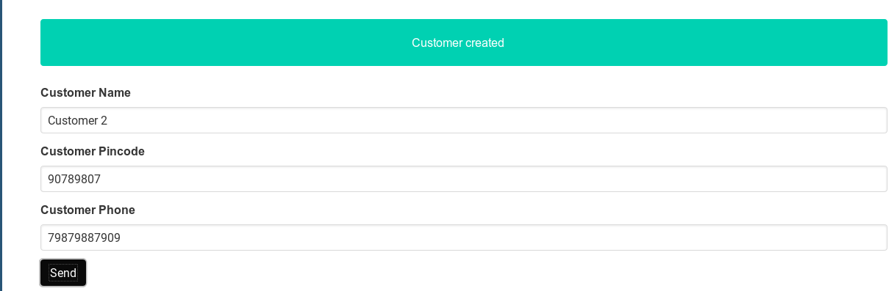

# Building Customer Management Features

In this chapter, we will implement the customer management feature. As you can see the functionality provided by product management is very similar to that should be provided by customer management feature.
The data to be stored is different, but the provided operations are similar like creation, editing etc. For the same reason, we can simply copy the **components/product** folder and rename it as **components/customer**.
Rename all occurrences of **Product** with **Customer**. So our directory structure looks like below.

```bash
customer
├── AddCustomer.vue
├── CustomerList.vue
├── CustomerView.vue
└── EditCustomer.vue
```

## Modeling Customer in Typescript

**types/types.ts** file contains our **Customer** structure, we generated from the database.

```typescript
export interface Customer {
  updated_at: Date;
  pincode: string;
  phone: string;
  name: string;
  inserted_at: Date;
  id: number;
  details: object;
}
```

We can provide an implementation for **Customer** interface just like what we did for **Product**.
Here we use the [**Mapped Types**](https://www.typescriptlang.org/docs/handbook/advanced-types.html#mapped-types) in Typescript for cleaner constructor.
Mapped Types allows us to create new types based on old types. For example the **Partial<T>** we use below can be defined as

```typescript
// Makes all the fields in T optional with ?
type Partial<T> = {
  [P in keyof T]?: T[P];
};
```

We can also define other types like **Readonly** as below.

```typescript
type Readonly<T> = {
  readonly // Make all fields in T, readonly
  [P in keyof T]: T[P];
};
```

## Implementing Customer

Our implementation of **Customer** can be as follows.

```Typescript
class CustomerImpl implements Customer {
  // Initialize variable with default variables.
  inserted_at: Date = new Date();
  updated_at: Date = new Date();
  pincode: string = '';
  phone: string = '';
  name: string = '';
  id: number = 0;
  details: object = {};

  /* Mapped Types in Typescript.
   * Partial<T> makes all fields of T as optional.
   * This allows us to just update the values passed in
   * constructor(which itself is optional with a ?) and assigns to our object.
   * Then we can initialize like new CustomerImpl({name: "MyName"})
   */
  public constructor(customer?: Partial<Customer>) {
    Object.assign(this, customer);
  }
}

// Factory methods
export function getEmptyProduct() {
  return new ProductImpl();
}

export function getEmptyCustomer() {
  return new CustomerImpl();
}
```

## Talking with Phoenix Backend

In order to communicate with our Phoenix backend, we need to create a customerService like productService.
For this we copy **services/productService.ts** as **customerService.ts** and simply replace **product** with **customer** and **Product** with **Customer**.
This is possible as we have similar functionality and uniform interface to our backend server. Our resulting customerService is as follows.

```typescript
import axios, { AxiosPromise } from "axios";
import { Customer, getEmptyCustomer } from "@/types/types";

export class CustomerService {
  private endpoint: string;
  private entity: string;

  constructor(endpoint: string, entity: string) {
    this.endpoint = endpoint;
    this.entity = entity;
  }

  public getAllRequest(): AxiosPromise<{ customers: Customer[] }> {
    const response = axios.get(`${this.endpoint}${this.entity}`);
    return response;
  }

  public createCustomer(data: Customer): AxiosPromise<{ customer: Customer }> {
    return axios.post(`${this.endpoint}${this.entity}`, { customer: data });
  }

  public updateCustomer(
    identifier: number,
    data: Customer
  ): AxiosPromise<{ customer: Customer }> {
    return axios.put(`${this.endpoint}${this.entity}/${identifier}`, {
      customer: data,
    });
  }

  public getCustomer(identifier: number): AxiosPromise<{ customer: Customer }> {
    return axios.get(`${this.endpoint}${this.entity}/${identifier}`);
  }

  public deleteCustomer(identifier: number): AxiosPromise<any> {
    return axios.delete(`${this.endpoint}${this.entity}/${identifier}`);
  }

  public getEmpty(): Customer {
    return getEmptyCustomer();
  }
}
```

In order to persist the customer data, we need to define the Vuex module. Just like **customerService** it is very similar to **store/modules/products.ts**.
So we follow the same procedure as above. Copy the **products.ts** as **customers.ts** and replace all occurrences of **product** with **customer** and **Product** with **Customer** and we are ready to go.

## Building the Customer View

In order to display the customer details, we need the **CustomerView.vue**. We can see it is similar to our **Productview.vue**. The implementation is as follows.

```html
<template>
  <div>
    <div class="field">
      <div class="control">
        <label class="label" for="customerName"
          >{{ $t('customerName.label') }}</label
        >
        <!-- We bind currentCustomer.name to this input field -->
        <input
          class="input"
          id="customerName"
          type="text"
          v-model="currentCustomer.name"
        />
      </div>
    </div>

    <div class="field">
      <div class="control">
        <label for="customerPincode" class="label"
          >{{ $t('customerPincode.label') }}</label
        >
        <input
          class="input"
          id="customerPincode"
          type="text"
          v-model="currentCustomer.pincode"
        />
      </div>
    </div>

    <div class="field">
      <div class="control">
        <label class="label" for="customerPhone"
          >{{ $t('customerPhone.label') }}</label
        >
        <input
          class="input"
          id="customerPhone"
          type="text"
          v-model="currentCustomer.phone"
        />
      </div>
    </div>

    <div class="field">
      <div class="control">
        <slot></slot>
      </div>
    </div>
  </div>
</template>

<script lang="ts">
  import { Customer } from "@/types/types.ts";
  import { Component, Prop } from "vue-property-decorator";
  import Vue from "vue";

  @Component({
    components: {},
  })
  export default class CustomerView extends Vue {
    // Prop are data values that are passed from parent component to child component
    @Prop()
    public currentCustomer!: Customer;
  }
</script>

<style lang="sass" scoped></style>

<i18n>
  { "de": { "customerName": { "label": "Kunde Name" }, "customerPincode": {
  "label": "Kunde postleitzahl" }, "customerPhone": { "label": "Kunde Stock" }
  }, "en": { "customerName": { "label": "Customer Name" }, "customerPincode": {
  "label": "Customer Pincode" }, "customerPhone": { "label": "Customer Phone" }
  } }
</i18n>
```

Now implementing **CustomerList.vue** and **AddCustomer.vue** is very straightforward as both of them simply use **CustomerView.vue** component.
To implement **CustomerList** simply replace **Product** with **Customer** and **product** with **customer**. Same is the case for **AddCustomer** component too.

Now the only thing left is to add the customer management functionality to our **src/router.ts**, so that we can actually use it. In router we add the following code and we are ready for action.

```typescript
    {
      path: '/customers',
      name: 'customers',
      component: () => import('./components/customer/CustomerList.vue'),
    },
    {
      path: '/customers/add',
      name: 'add-customer',
      component: () => import('./components/customer/AddCustomer.vue'),
    },
    {
      path: '/customers/edit/:id',
      name: 'edit-customer',
      component: () => import('./components/customer/EditCustomer.vue'),
      props: true,
    },
```

Now go to **localhost:8080/customers/add** and we can add customers, just like products.



## Testing Customer Functionity using Jest

Now for the test cases, just copy **test/unit/product** and rename to **test/unit/customer**. Then replace all occurrences of **product** with **customer** and **Product** and **Customer**.
The resulting **test/unit/customer/AddCustomer.spec.ts** will be as follows.

```typescript
import "jest";
import { mount } from "@vue/test-utils";
import AddProduct from "@/components/product/AddProduct.vue";
import { Product } from "@/types/types";
import products from "@/store/modules/products";
import { doesNotReject } from "assert";

// We mock the whole store/modules/products module, with jest.
jest.mock("@/store/modules/products", () => ({
  service: {
    // jest.fn creates a mock function which replaces actual implementation
    // of a function. It captures all calls to a function with arguments and more.
    createProduct: jest.fn(() => async (p: Product) => {
      return {};
    }),
    getEmpty: () => {
      return {};
    },
  },
}));

describe("AddProduct.vue", () => {
  test("Checks if the product is sent correctly when clicking submit button",
    async () => {
    // mount, mounts the component AddProduct in isolation and
    // returns a wrapper with helper functions.
    const wrapper = mount(AddProduct, {
      mocks: {
        // Here we pass a mock for global function $t.
        // $t is the translation function from vue-i18n
        $t: () => {},
      },
    });
    // Finds the element with id productName
    const inputV = wrapper.find("#productName");
    // We manually set the value of input field to testNamer
    inputV.setValue("testNamer");
    // And we trigger a click event to see if required functions are getting called.
    wrapper.find("[type='submit']").trigger("click");

    // We need to cast to HTMLInputElement, because Typescript by default
    // provides a generic HTMLElement, which lacks some function from an input field
    const t = inputV.element as HTMLInputElement;
    // Check if the value we had set before clicking submit
    // is sent to createProduct function.
    expect(products.service.createProduct).toBeCalledWith({
      name: "testNamer",
    });
  });

  test("Check if product created notification is seen when showNotification is set",
    async () => {
    // mount, mounts the component AddProduct in isolation and
    // returns a wrapper with helper functions.
    const wrapper = mount(AddProduct, {
      mocks: {
        // Here we pass a mock for global function $t.
        // $t is the translation function from vue-i18n
        $t: () => {},
      },
    });
    // We set showNotification to true and wait for
    // Vue to update DOM by waiting for vm.nextTick
    wrapper.vm.$data.showNotification = true;
    await wrapper.vm.$nextTick();
    // Search for element with class=notification
    const t = wrapper.find(".notification");
    // Assert the element is visible.
    expect(t.isVisible()).toBe(true);
  });
});
```

As you can see by now, we got a lot of duplicate code. These can be easily fixed by refactoring which we will do in the next chapter.
